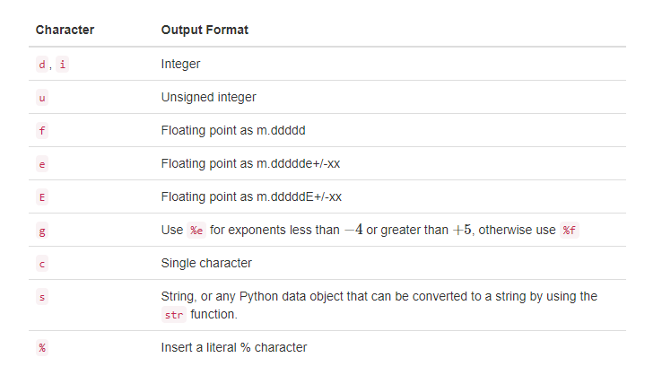
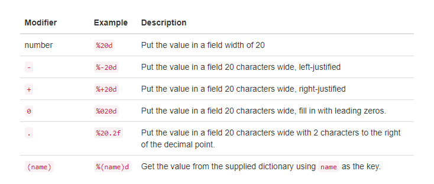

## 1.9.输入和输出

我们经常需要与用户交互，要么获取数据，要么提供某种结果。现今的大多数程序都使用一个对话框来让用户提供某种类型的输入。虽然Python确实有创建对话框的方法，但是我们可以使用一个简单得多的函数。Python为我们提供了一个功能，允许我们要求用户输入一些数据，并以字符串的形式返回数据的引用。这个函数叫做input。

Python的输入函数接受单个参数，即字符串。这个字符串通常被称为提示符，因为它包含一些有用的文本，提示用户输入一些东西。例如，您可以按如下方式调用输入：

````
aName = input('Please enter your name: ')
````

现在，无论用户在提示符后面输入什么，都将存储在aName变量中。通过使用input函数，我们可以轻松地编写指令，提示用户输入数据，然后将这些数据合并到进一步的处理中。例如，在接下来的两个语句中，首先询问用户的名称，第二个语句打印基于所提供的字符串的一些简单处理的结果。

````
aName = input("Please enter your name ")
print("Your name in all capitals is",aName.upper(),
      "and has length", len(aName))
````

需要注意的是，输入函数返回的值将是一个字符串，表示在提示后输入的确切字符。如果您想将此字符串解释为另一种类型，您必须提供显示的类型转换。在下面的语句中，由用户输入的字符串被转换为浮点数，以便它可以用于进一步的算术处理。

````
sradius = input("Please enter the radius of the circle ")
radius = float(sradius)
diameter = 2 * radius
````


### 1.9.1.格式化字符串

我们已经看到打印功能提供了一种非常简单的方法来从Python程序输出值。print采用零个或更多的参数，并使用单个空格作为默认分隔符来显示它们。可以通过设置sep参数来更改分隔符。此外，每次打印在默认情况下都以换行符结尾。可以通过设置结束参数来改变这种行为。这些变化将显示在以下会话中：

````
>>> print("Hello")
Hello
>>> print("Hello","World")
Hello World
>>> print("Hello","World", sep="***")
Hello***World
>>> print("Hello","World", end="***")
Hello World***>>>
````

更多的控制输出的外观通常是有用的。幸运的是，Python为我们提供了一种称为格式化字符串的替代方案。格式化的字符串是一个模板，在这个模板中，结合了保持不变的单词或空格与插入到字符串中的变量的占位符。例如,语句

````
print(aName, "is", age, "years old.")
````

包含词语is 和 years old，但是名称和年龄将根据执行时的变量值而变化。使用格式化的字符串，我们将前面的语句写为

````
print("%s is %d years old." % (aName, age))
````

这个简单的例子说明了一个新的字符串表达式。%号是一个字符串操作符，称作格式化操作符。表达式的左边含有模板或格式字符串，右边包含将被替换成格式字符串的值的集合。请注意，右侧集合中的值的数量与格式字符串中的%字符数相对应。值从左到右依次从集合中获取并插入到格式字符串中。

让我们更详细地看一下这个格式化表达式的两边。格式字符串可以包含一个或多个转换规范。一个转换字符告诉格式化操作符将插入到字符串中的那个位置的值类型。在上面的例子中，%s指定一个字符串，而%d指定一个整数。其他可能的类型规范包括i、u、f、e、g、c或%。Table 9总结了各种类型的规范。



*Table 9*

除了格式字符之外，您还可以在%和格式字符之间包含一个格式修饰符。格式修饰符可以用来对指定字段宽度的值进行左对齐或右对齐。修饰符也可以用来指定字段宽度，以及小数点后的数字。Table 10解释了这些格式修饰符



*Table 10*

格式操作符的右边是一组值，这些值将被插入到格式字符串中。集合将是一个元组或一个字典。如果集合是一个元组，那么这些值就会按照位置的顺序插入。也就是说，元组中的第一个元素对应于格式字符串中的第一个格式字符。如果集合是一个字典，那么这些值将根据它们的键插入。在这种情况下，所有格式字符都必须使用(name)修饰符来指定键的名称。

````
>>> price = 24
>>> item = "banana"
>>> print("The %s costs %d cents"%(item,price))
The banana costs 24 cents
>>> print("The %+10s costs %5.2f cents"%(item,price))
The     banana costs 24.00 cents
>>> print("The %+10s costs %10.2f cents"%(item,price))
The     banana costs      24.00 cents
>>> itemdict = {"item":"banana","cost":24}
>>> print("The %(item)s costs %(cost)7.1f cents"%itemdict)
The banana costs    24.0 cents
>>>
````

除了使用格式字符和格式修饰符的格式字符串之外，Python字符串还包括一种format方法，它可以与新的Formatter类一起使用来实现复杂的字符串格式化。有关这些功能的更多信息，请参阅Python库参考手册。


